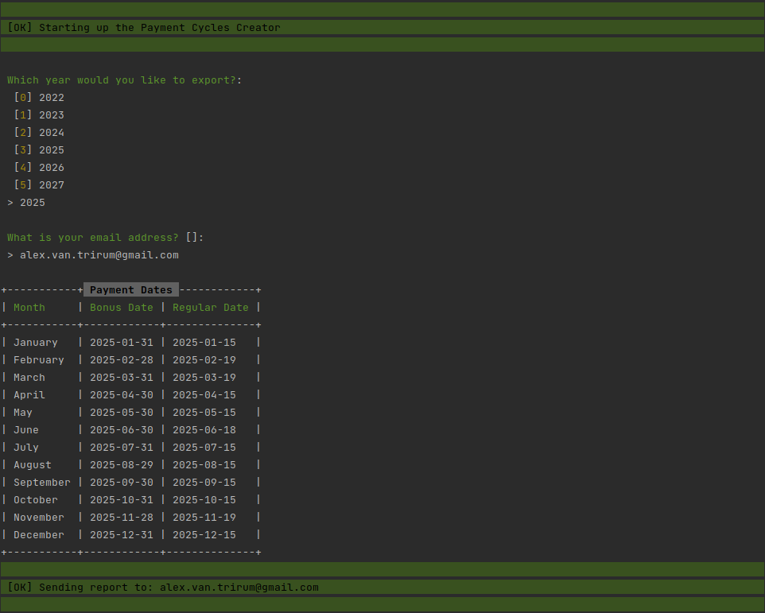

# Salary Cycles Generator

### Command Line Interface
> Use this command
> symfony console salary:report

## Read mails:
>**Use this command:**
>
symfony open:local:webmail

## Deploy with Docker:

> docker-compose up --build -d

## Install js packages:

> yarn install
> yarn run encore production

## API Endpoints:

> <b>Supported years:</b>
> http://localhost/api/payment/cycles

> <b>Specific year example:</b>
> http://localhost/api/payment/cycle/2022